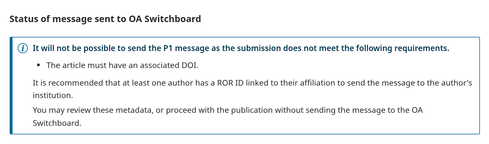
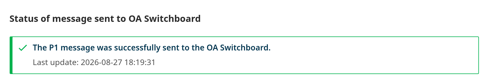

**Español** | [English](/README.md) | [Português Brasileiro](/docs/README-pt_BR.md)

# Módulo Open Access Switchboard

Este módulo conecta las revistas que usan [OJS](https://pkp.sfu.ca/software/ojs/) con [OA Switchboard](https://www.oaswitchboard.org/), la infraestructura compartida que intercambia metadatos de comunicación científica entre editoriales, instituciones y financiadores. Cuando se publica un artículo, sus [metadatos de publicación](#qué-metadatos-se-envían) se extraen automáticamente y se envían a las instituciones y a los financiadores de investigación pertinentes como un **mensaje P1-PIO** estandarizado.

**Anuncio:** [OA Switchboard OJS plug-in: Supporting diamond journals to increase the visibility of their OA output among research funders, libraries, and consortia](https://www.oaswitchboard.org/ojs-plugin).

## Cómo funciona

Antes de la publicación, el módulo comprueba si el artículo tiene los metadatos que OA Switchboard requiere y muestra el resultado en la pestaña **OA Switchboard**, dentro del flujo de trabajo del envío. Los artículos con requisitos pendientes pueden publicarse con normalidad, simplemente sin que se envíe el mensaje.

## Primeros pasos

### Lo que necesita su instalación de OJS

Dos ajustes habituales de OJS, que normalmente ya están en su sitio:

- **Tareas en segundo plano** en ejecución, para que los mensajes salgan justo después de la publicación ([Guía del Administrador de PKP](https://docs.pkp.sfu.ca/admin-guide/)).
- **`api_key_secret`** configurado, para que sus credenciales se almacenen cifradas ([cómo definirlo](https://forum.pkp.sfu.ca/t/how-to-generate-a-api-key-secret-code-in-ojs-3/72008)).

Ambos son ajustes únicos, válidos para toda la instalación, que su administrador de sistemas puede dejar listos.

### 1. Hágase participante de OA Switchboard

Firme el Service Agreement en el [sitio de OA Switchboard](https://www.oaswitchboard.org/) para convertirse en participante y recibir el userID y la contraseña que utiliza el módulo.

### 2. Instale el módulo

Vaya a *Ajustes → Sitio web → Módulos → Galería de módulos*, localice **OA Switchboard Plugin**, pulse *Instalar* y actívelo.

> [!TIP]
> Si la galería no ofrece una versión compatible con su OJS, descargue el `.tar.gz` desde la [página de releases](https://github.com/lepidus/OASwitchboard/releases) y utilice **Cargar un nuevo módulo**.

### 3. Introduzca sus credenciales

Abra los *Ajustes* del módulo e introduzca su userID y su contraseña de OA Switchboard. Se comprueban al guardar, así que sabrá de inmediato si algo no está bien.

> [!NOTE]
> Si aparece un aviso en lugar del formulario, falta el `api_key_secret`. [Cómo definirlo](https://forum.pkp.sfu.ca/t/how-to-generate-a-api-key-secret-code-in-ojs-3/72008).

### 4. Prepare su revista

El mensaje solo se envía cuando estos metadatos están presentes:

- **Revista:** al menos un ISSN, impreso o electrónico.
- **Artículo:** un DOI asignado.
- **Todos los autores:** apellido y afiliación.

**Recomendado:** un **ROR ID** en la afiliación de al menos un autor. Es lo que permite a OA Switchboard encaminar el mensaje a esa institución.

**Opcional:** con el [módulo Funding](https://github.com/ajnyga/funding/tree/stable-3_5_0) instalado, los financiadores registrados en el artículo se incluyen automáticamente en el mensaje. Sin él, los mensajes se siguen enviando.

## En el día a día

Todo ocurre en la pestaña **OA Switchboard** del envío.

**Antes de publicar,** la pestaña indica si el artículo está listo y enumera lo que falta, para que pueda corregir los metadatos antes. Puede publicar en cualquiera de los dos casos.

**Después de publicar,** muestra lo que ocurrió:

| Estado | Significado |
| --- | --- |
| **Enviado** | OA Switchboard recibió el mensaje. |
| **En cola** | El mensaje está en camino. |
| **Falló** | Algo salió mal. Se muestra el motivo, junto con el botón **Intentar de nuevo**. |
| **No enviado** | El artículo no cumplía los requisitos cuando se publicó. |

## ¿Qué metadatos se envían?

Todo lo que se envía ya está en OJS; no se recoge nada nuevo.

Pulse aquí para ver la lista completa

- Sobre la **Publicación**:
  - Título
  - Tipo
  - DOI
  - ID del envío
  - Fecha de envío
  - Fecha de aceptación
  - Fecha de publicación
  - ID del manuscrito
  - VoR (Version of Record)
    - Tipo de publicación de la revista
    - Licencia
- Sobre cada **Autor/a**:
  - Nombre
  - Apellido
  - ORCID
  - Posición en el orden de aparición
  - Si es autor/a de correspondencia
  - Institución de afiliación
    - Nombre
    - ROR ID
- Sobre cada **Financiador**: (si está disponible mediante el módulo Funding)
  - Nombre
  - Identificador
- Sobre la **Revista**:
  - Título
  - ID (puede ser ISSN o eISSN)
  - ISSN
  - eISSN
- Momento del flujo de trabajo en que se envía el mensaje.

## Vídeo de demostración

*Grabado en OJS 3.3: los pasos son los mismos, pero la interfaz ha cambiado y la pestaña del flujo de trabajo es posterior al vídeo.*

## Solución de problemas

<strong>El envío falló</strong>

Normalmente por credenciales caducadas o una interrupción temporal. Vuelva a introducir las credenciales si hace falta y utilice **Intentar de nuevo**. Hay más detalle en los registros del servidor de OJS.

<strong>La pestaña dice que el módulo no está configurado</strong>

Las credenciales todavía no se han guardado, o su revista no tiene ISSN.

<strong>Un mensaje se quedó en cola</strong>

Pida a su administrador de sistemas que compruebe que las tareas en segundo plano están en ejecución.

## Dónde obtener ayuda

- **El módulo:** abra una issue en este repositorio.
- **Su cuenta o sus mensajes en OA Switchboard:** contacte con [OA Switchboard](https://www.oaswitchboard.org/).
- **El propio OJS:** pregunte en el [foro de la comunidad PKP](https://forum.pkp.sfu.ca/).

## Compatibilidad de versiones

Cada línea de versión de OJS tiene su propia rama en este repositorio. Esta es la de **OJS 3.5.0.x**.

| Versión del módulo | Versión de OJS | Rama |
| --- | --- | --- |
| `v3.x.x.x` | 3.5.0.x | [`main`](https://github.com/lepidus/OASwitchboard/tree/main) (esta rama) |
| `v2.x.x.x` | 3.4.0.x | [`stable-3_4_0`](https://github.com/lepidus/OASwitchboard/tree/stable-3_4_0) |
| `v1.x.x.x` | 3.3.0.x | [`stable-3_3_0`](https://github.com/lepidus/OASwitchboard/tree/stable-3_3_0) |

## Créditos

Este módulo fue desarrollado como software libre para [OA Switchboard](https://www.oaswitchboard.org/) por [Lepidus Tecnologia](https://lepidus.com.br/), con [Openjournals.nl](http://openjournals.nl/) como socio de pruebas. El desarrollo fue posible gracias a la financiación de la [Max Planck Digital Library (MPDL)](https://www.mpdl.mpg.de/en/).

Desarrollado por [Lepidus Tecnologia](https://github.com/lepidus).

## Licencia

Este módulo se distribuye bajo la [Licencia Pública General GNU v3.0](/LICENSE).

Copyright (c) 2024 Lepidus Tecnologia.
Copyright (c) 2024 Stichting OA Switchboard
